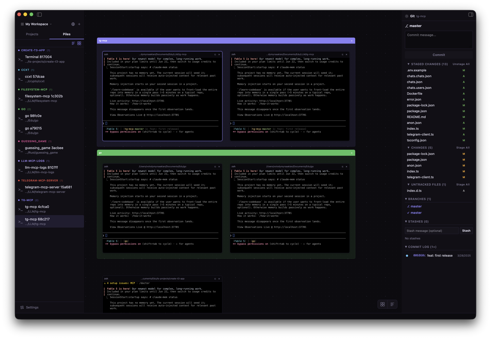
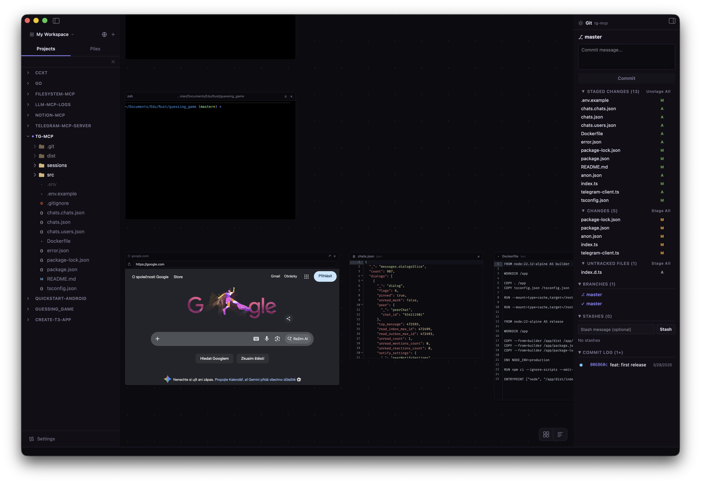
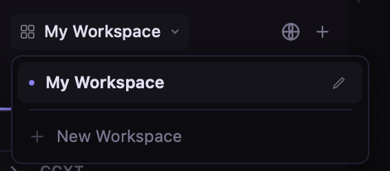
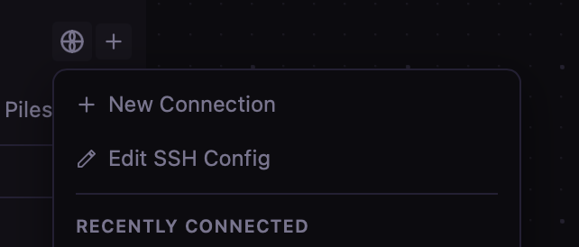

<div align="center">


# Panescale

**Terminals, files, and code — arranged on an infinite canvas.**

[](https://github.com/lossless1/panescale/releases/latest)
[](LICENSE)
[](https://github.com/lossless1/panescale/actions)
[]()
[](https://tauri.app)
[](https://github.com/lossless1/panescale/stargazers)

<br />



<br />
<br />

[Download](https://github.com/lossless1/panescale/releases/latest) &nbsp;&bull;&nbsp; [Features](#features) &nbsp;&bull;&nbsp; [Install](#install) &nbsp;&bull;&nbsp; [Contributing](CONTRIBUTING.md)

</div>

---

## What is Panescale?

Panescale is a desktop app that gives you an infinite canvas for organizing terminal sessions, files, and notes — all in one place. No tab hunting. No context switching. Just your work, side by side.

- **Infinite canvas** — Pan, zoom, and arrange terminal windows freely on a spatial surface
- **Floating terminals** — Spawn, drag, resize, and layer terminal tiles anywhere on the canvas
- **Persistent sessions** — Close the app, reopen it, pick up exactly where you left off (tmux-backed)
- **Full git UI** — Stage, commit, diff, branch, stash, and resolve conflicts without leaving the app
- **SSH connections** — Connect to remote servers and open terminal tiles on the canvas
- **Content tiles** — Drop markdown notes, images, and file previews alongside your terminals
- **Browser tiles** — Embed live web pages right on the canvas, next to your terminals
- **Workspaces** — Keep separate canvases per project and switch between them instantly
- **Containers** — Group tiles with colored containers, auto-group by directory

Built with [Tauri v2](https://tauri.app) (Rust) + [React](https://react.dev) + [xterm.js](https://xtermjs.org).

## Features

### Canvas

| Feature | Description |
|---------|-------------|
| **Infinite pan & zoom** | Scroll, Space+drag, middle-click, pinch — 10% to 200% range |
| **Dot grid** | Adaptive grid that scales with zoom level |
| **Magnetic snap** | Tiles snap to grid (~10px threshold), Cmd/Ctrl to override |
| **Alignment guides** | Smart edge/center guides when dragging tiles near each other |
| **Minimap** | Toggle with `M` key, click to navigate |
| **Containers** | Group tiles in named, colored containers — right-click header to rename, change color, or delete |
| **Auto-group** | One-click grouping of terminals by working directory |
| **Color picker** | 12 preset colors + custom color picker for containers |
| **Persistent layout** | Canvas state auto-saves and restores on relaunch |

### Terminals

| Feature | Description |
|---------|-------------|
| **Double-click to spawn** | Double-click empty canvas space to create a terminal |
| **Right-click menu** | Right-click canvas to spawn a terminal, browser, or container |
| **Drag & resize** | Title bar drag + 8-handle resize with live reflow |
| **Search** | Cmd+F to search terminal output |
| **Clickable URLs** | URLs in terminal output open in your browser |
| **Process title** | Title bar shows the currently running process |
| **Badges & rename** | Color-code and name your terminals |
| **Startup commands** | Auto-run commands when terminals restore |
| **Bell notifications** | Audio chime + sidebar pulse when a process completes |
| **tmux persistence** | Sessions survive app restarts (transparent, auto-installed) |

### Browser & Content Tiles

<div align="center">

</div>

| Feature | Description |
|---------|-------------|
| **Browser tiles** | Embed live web pages on the canvas with a URL bar, history suggestions, and reload |
| **Open external** | Send any browser tile's page to your system browser in one click |
| **Markdown notes** | Drop rendered markdown notes anywhere on the canvas |
| **File previews** | Open files as tiles with syntax-highlighted code editing |
| **Images** | Drag images onto the canvas as resizable tiles |

### Workspaces

<div align="center">

</div>

| Feature | Description |
|---------|-------------|
| **Multiple canvases** | Each workspace has its own canvas, tiles, and layout |
| **Instant switching** | Jump between workspaces from the sidebar dropdown |
| **Rename inline** | Rename workspaces directly from the switcher |

### Sidebar

| Feature | Description |
|---------|-------------|
| **File tree** | Hierarchical + chronological view modes |
| **File operations** | Create, rename, delete, move via right-click menu |
| **Fuzzy search** | Cmd+K to find files instantly |
| **Drag to canvas** | Drop files from sidebar to create content tiles |
| **Terminal list** | See all open terminals, click to navigate |
| **Group by directory** | Group terminals by cwd with colors synced to canvas containers |
| **Sort & reorder** | Sort A-Z or drag to reorder terminals |

### Git

| Feature | Description |
|---------|-------------|
| **Status panel** | Staged / Unstaged / Untracked file groups |
| **Hunk staging** | Stage individual code hunks, not just files |
| **Inline diff** | Unified diff viewer in sidebar |
| **Branches** | Create, switch, delete branches |
| **Commit graph** | SVG topology graph with lane assignment |
| **Stash** | Save, apply, pop, drop stashes |
| **Conflicts** | Accept ours/theirs per file |

### SSH

<div align="center">

</div>

| Feature | Description |
|---------|-------------|
| **Quick connect** | New connection and recently connected hosts, one click from the sidebar |
| **Connection manager** | Save host, port, user, key file |
| **SSH config** | Edit your SSH config straight from the app |
| **Groups** | Organize connections in folders |
| **Remote terminals** | SSH terminals behave identically to local ones |
| **Remote file browser** | Browse and open files on remote servers |

### Theming

| Feature | Description |
|---------|-------------|
| **Dark & light** | Deep dark default, light theme available |
| **System detection** | Auto-follows OS dark/light preference |
| **Terminal schemes** | One Dark and Dracula presets |
| **Rounded corners** | Native-feeling window on macOS |

## Install

### Download

**[Download the latest release](https://github.com/lossless1/panescale/releases/latest)** for your platform:

| Platform | Format |
|----------|--------|
| macOS (Intel + Apple Silicon) | `.dmg` (universal) |
| Linux | `.AppImage`, `.deb` |
| Windows | `.msi`, `.exe` (NSIS) |

### Build from source

**Prerequisites:** [Rust](https://rustup.rs), [Node.js 20+](https://nodejs.org), [pnpm](https://pnpm.io), platform-specific [Tauri dependencies](https://v2.tauri.app/start/prerequisites/)

```bash
git clone https://github.com/lossless1/panescale.git
cd panescale
pnpm install
pnpm tauri dev
```

## Stack

| Technology | Purpose |
|------------|---------|
| [Tauri v2](https://tauri.app) | Desktop shell (Rust backend, webview frontend) |
| [React 19](https://react.dev) | UI framework |
| [React Flow](https://reactflow.dev) | Infinite canvas engine |
| [xterm.js](https://xtermjs.org) | Terminal emulation |
| [git2](https://github.com/rust-lang/git2-rs) | Git operations (Rust) |
| [russh](https://github.com/warp-tech/russh) | SSH client (Rust) |
| [Zustand](https://zustand-demo.pmnd.rs) | State management |
| [Tailwind CSS](https://tailwindcss.com) | Styling |
| [shiki](https://shiki.style) | Syntax highlighting |
| [marked](https://marked.js.org) | Markdown rendering |

## Keyboard Shortcuts

| Shortcut | Action |
|----------|--------|
| `Cmd/Ctrl + K` | Fuzzy file search |
| `Cmd/Ctrl + F` | Search in focused terminal |
| `Cmd/Ctrl + =` / `-` | Zoom in / out |
| `Cmd/Ctrl + 0` | Fit all tiles |
| `M` | Toggle minimap |
| `Escape` | Exit terminal focus / close search |
| `Space + drag` | Pan canvas |
| `Shift + scroll` | Pan canvas (over terminal) |
| `Cmd/Ctrl + Enter` | Commit (in git panel) |

## Contributing

See [CONTRIBUTING.md](CONTRIBUTING.md) for guidelines.

## License

[MIT](LICENSE)

---

<div align="center">

Built with Rust and TypeScript.

</div>
